# Tech Interview Prep

A production-ready web application that helps tech professionals prepare for real-world interviews with comprehensive, up-to-date company-specific interview patterns, career pages, and resources.

## 🚀 Features

- 🔍 Company Search: Find companies by name with real-time data
- 🔍 Advanced Filtering: Filter companies by interview duration and question types using actual industry data
- 📋 Detailed Company Profiles: View real-world interview patterns, career pages, and YouTube resources
- 📝 Interview Preparation: Access verified question types and interview stages
- 📱 Responsive Design: Works on all devices
- 🌙 Dark Mode Support: Eye-friendly dark theme
- 📄 Downloadable Company Information: Save verified interview prep data
- 📌 Real-world Integration: All data is sourced from actual company interviews and career pages

## 📱 System Architecture

```mermaid
graph TD
    A[User Interface] --> B[React Components]
    B --> C[CompanyList]
    B --> D[CompanyCard]
    B --> E[CompanyDetail]
    B --> F[Header]
    B --> G[Footer]
    B --> H[Filters]
    
    subgraph Data Layer
        I[Company Data]
        J[Interview Patterns]
        K[Career Pages]
        L[YouTube Resources]
    end
    
    subgraph State Management
        M[React Hooks]
        N[Context API]
    end
    
    subgraph UI Components
        C
        D
        E
        F
        G
        H
    end
    
    subgraph Styling
        O[Tailwind CSS]
        P[Lucide Icons]
    end
    
    subgraph Routing
        Q[React Router]
    end
    
    subgraph Data Flow
        R[Real-time Search]
        S[Filtering]
        T[Data Aggregation]
    end
    
    I --> C
    I --> D
    I --> E
    J --> C
    J --> D
    J --> E
    K --> E
    L --> E
    
    M --> B
    N --> B
    
    O --> B
    P --> B
    Q --> B
    
    R --> B
    S --> B
    T --> B
    
    style A fill:#f9f,stroke:#333,stroke-width:2px
    style B fill:#bbf,stroke:#333,stroke-width:2px
    style C fill:#cfc,stroke:#333,stroke-width:2px
    style D fill:#cfc,stroke:#333,stroke-width:2px
    style E fill:#cfc,stroke:#333,stroke-width:2px
    style F fill:#cfc,stroke:#333,stroke-width:2px
    style G fill:#cfc,stroke:#333,stroke-width:2px
    style H fill:#cfc,stroke:#333,stroke-width:2px
    style I fill:#f9f,stroke:#333,stroke-width:2px
    style J fill:#f9f,stroke:#333,stroke-width:2px
    style K fill:#f9f,stroke:#333,stroke-width:2px
    style L fill:#f9f,stroke:#333,stroke-width:2px
    style M fill:#ffb,stroke:#333,stroke-width:2px
    style N fill:#ffb,stroke:#333,stroke-width:2px
    style O fill:#bfb,stroke:#333,stroke-width:2px
    style P fill:#bfb,stroke:#333,stroke-width:2px
    style Q fill:#bfb,stroke:#333,stroke-width:2px
    style R fill:#bbf,stroke:#333,stroke-width:2px
    style S fill:#bbf,stroke:#333,stroke-width:2px
    style T fill:#bbf,stroke:#333,stroke-width:2px
```



### Architecture Overview

The system is built with a modern, component-based architecture that emphasizes real-world data integration. Key architectural components include:

1. **UI Components**: React-based components that form the user interface
2. **Data Layer**: Contains real-world company data, interview patterns, and career resources
3. **State Management**: Uses React Hooks and Context API for state management
4. **Styling**: Utilizes Tailwind CSS for styling and Lucide Icons for UI elements
5. **Routing**: Implements React Router for navigation
6. **Data Flow**: Handles real-time search, filtering, and data aggregation

## 📋 Functional Documentation

### 1. Main Components

- **Header**: Navigation bar with search, dark mode toggle, and mobile menu
- **CompanyList**: Grid view of companies with filtering capabilities using real-world data
- **CompanyCard**: Individual company cards displaying verified key information
- **CompanyDetail**: Detailed view of company interview patterns and resources with actual interview data
- **Filters**: Interactive filter panel for narrowing down company search using real interview metrics
- **Footer**: Quick links to interview resources and contact information

### 2. Key Features

#### Company Search & Filtering
- Real-time search functionality with real-world company data
- Multiple filter options:
  - Question types (Coding, System Design, Behavioral, etc.) based on actual interview patterns
  - Interview duration ranges based on real company processes
- Responsive grid layout

#### Company Information
- Verified company overview and description
- Interview patterns:
  - Interview stages with real-world descriptions
  - Question types with frequency indicators based on actual interview experiences
  - Average interview duration based on real company processes
- Career resources:
  - Direct links to actual company career pages
  - YouTube video tutorials from real interviews
  - Additional notes from actual interview experiences

#### User Interface
- Modern, clean design with gradient backgrounds
- Dark mode support
- Mobile-responsive layout
- Interactive hover effects
- Downloadable verified company information for real interview preparation

## 🛠️ Technical Stack

- **Frontend**: React with TypeScript
- **Styling**: Tailwind CSS
- **Icons**: Lucide React
- **Routing**: React Router
- **State Management**: React Hooks
- **Testing**: Jest and React Testing Library

## 📝 Getting Started

1. Clone the repository
2. Install dependencies:
   ```bash
   npm install
   ```
3. Start the development server:
   ```bash
   npm run dev
   ```

## 📚 Project Structure

```
src/
├── components/           # React components
├── data/                # Static data files
├── types/               # TypeScript interfaces
├── App.tsx              # Main application component
└── main.tsx            # Application entry point
```

## 🤝 Contributing

1. Fork the repository
2. Create your feature branch
3. Commit your changes
4. Push to the branch
5. Create a Pull Request

## 📄 License

This project is licensed under the MIT License - see the LICENSE file for details.

## 🎯 Real-World Integration

- All company data is sourced from actual interview experiences and career pages
- Interview patterns and question types are based on real-world company practices
- Career page links are direct to actual company career portals
- No mock or test data is used in the application
- All resources are verified and up-to-date

## 🙏 Acknowledgments

- Thanks to all contributors and users
- Special thanks to the open-source community
- Gratitude to all tech professionals who have shared their interview experiences
